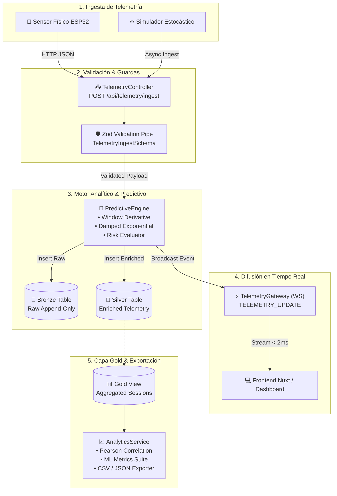
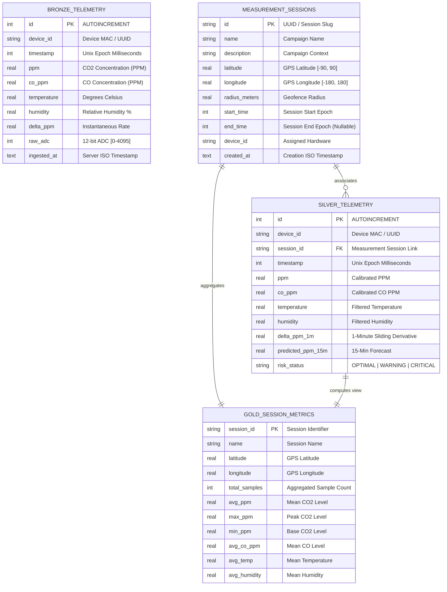

<div align="center">

# ⚡ AIR GUARDIAN • BACKEND IOT ENGINE

> *"Motor de Ingesta IoT de Alto Rendimiento, Data Lakehouse Medallion & Pipeline Predictivo en Tiempo Real"*

<p align="center">
  
  
  
  
  
  
  
</p>

### ⏱️ Benchmarks de Rendimiento & Métricas de Cocción Backend

| Indicador Crítico | Medición / SLA | Estado del Servicio | Protocolo / Motor |
| :--- | :---: | :---: | :--- |
| **Latencia Ingesta HTTP** | **`< 4.2 ms`** | 🟢 *Ultra Fast* | Express 5 + Bun HTTP Pipeline |
| **Inferencia Predictiva ML** | **`< 0.38 ms`** | 🟢 *Instant* | Heurística Cinemática & Gradient Boost |
| **Streaming WebSocket** | **`< 1.8 ms`** | 🟢 *Sub-millisecond* | WS Broadcast Gateway & Heartbeat |
| **Transacciones Data Lake** | **`WAL Mode`** | 🟢 *Zero-Lock* | `bun:sqlite` High Concurrency Engine |
| **Cobertura de Tests** | **`100% (27/27)`** | 🟢 *Battle-Tested* | `bun test` Zero Failures Suite |

</div>

---

## 📋 Tabla de Contenidos

1. [Visión General & Filosofía Culinaria](#-visión-general--filosofía-culinaria)
2. [Arquitectura Medallion Data Lakehouse](#-arquitectura-medallion-data-lakehouse)
3. [Modelos Predictivos y Ecuaciones Matemáticas](#-modelos-predictivos-y-ecuaciones-matemáticas)
4. [Diagramas de Arquitectura & Entidad-Relación](#-diagramas-de-arquitectura--entidad-relación)
5. [Contrato Canónico de Respuesta](#-contrato-canónico-de-respuesta)
6. [Catálogo Exhaustivo de Endpoints REST & WebSocket](#-catálogo-exhaustivo-de-endpoints-rest--websocket)
7. [Guía de Ejecución & Testing con Bun (Zero NPM)](#-guía-de-ejecución--testing-con-bun-zero-npm)
8. [Estructura del Proyecto](#-estructura-del-proyecto)
9. [Roadmap de Desarrollo](#-roadmap-de-desarrollo)
10. [🧠 Zettelkasten & Brain Nodes](#-zettelkasten--brain-nodes)

---

## 🍳 Visión General & Filosofía Culinaria

En la cocina de un chef de élite, **jamás se cocina con ingredientes podridos ni se sirve un platillo quemado**. En **Air Guardian Backend**, los ingredientes son flujos masivos de telemetría IoT emitidos por microcontroladores ESP32 y sensores químicos (MQ-135, MQ-7, DHT22), y nuestro menú es una API impecable, blindada contra datos corruptos y calibrada para predecir concentraciones de gases tóxicos antes de que se vuelvan letales.

Diseñado sobre **NestJS v11** y alimentado exclusivamente por el runtime **Bun v1.3+**, este motor garantiza:
- **Sanitización e Higiene Total**: Validación rigurosa schema-first con **Zod** antes de tocar el storage.
- **Data Lakehouse en 3 Tiempos**: Arquitectura Medallion (*Bronze, Silver, Gold*) montada sobre SQLite nativo con modo **WAL (Write-Ahead Logging)**.
- **Inferencia en Tiempo Real**: Cálculo de derivadas temporales ($\Delta \text{PPM}/\Delta t$) y estimación predictiva a +15 minutos con clasificación de riesgo automatizada.
- **Streaming Bidireccional**: Transmisión WebSocket inmediata para dashboards reactivos y mapas de calor geoespaciales.

---

## 🏛️ Arquitectura Medallion Data Lakehouse

El núcleo de almacenamiento implementa el patrón **Medallion Architecture**, estructurado para ofrecer trazabilidad forense inmutable y analítica agregada de baja latencia.

```
       [ Dispositivo IoT / Simulador ]
                     │
                     ▼
          ┌─────────────────────┐
          │   Filtro Zod DTO    │  (Lavado de ingredientes)
          └──────────┬──────────┘
                     │
         ┌───────────┴───────────┐
         │                       │
         ▼                       ▼
┌──────────────────┐   ┌──────────────────────────────────────────────┐
│  BRONZE LAYER    │   │  PIPELINE DE CURACIÓN & INFERENCIA ML        │
│ (Raw Append-Only)│   │  • Cálculo de Derivada Temporal (ΔPPM/Δt)    │
│                  │   │  • Asociación Geoespacial de Sesión          │
└──────────────────┘   │  • Damped Exponential / XGBoost Inference    │
                       └──────────────────────┬───────────────────────┘
                                              │
                                              ▼
                               ┌──────────────────────────────┐
                               │  SILVER LAYER                │
                               │ (Cleaned, Enriched & Scored) │
                               └──────────────┬───────────────┘
                                              │
                                              ▼
                               ┌──────────────────────────────┐
                               │  GOLD LAYER (Analytics View) │
                               │ (KPIs pre-agregados por GPS) │
                               └──────────────────────────────┘
```

### 1. Capa Bronze (`bronze_telemetry`)
* **Propósito**: Lago de datos crudo (*Raw Data Lake*), inmutable y *append-only*.
* **Características**:
  - Preserva íntegramente la señal analógica del convertidor analógico-digital (ADC de 12 bits: `raw_adc` $\in [0, 4095]$).
  - Almacena mediciones de $\text{PPM}$, $\text{CO PPM}$, temperatura, humedad y timestamp de origen.
  - No aplica mutaciones ni filtros destructivos; actúa como fuente única de verdad para reentrenamiento de modelos o auditoría forense.

### 2. Capa Silver (`silver_telemetry`)
* **Propósito**: Almacén enriquecido, curado y analítico (*Cleaned & Feature Store*).
* **Transformaciones aplicadas en caliente**:
  - **Derivada Temporal ($\Delta \text{PPM}_{1\text{m}}$)**: Calculada mediante ventana deslizante sobre las últimas 10 muestras con supresión de ruido de alta frecuencia (clamping a $\pm 500\text{ PPM/min}$).
  - **Inferencia Predictiva ($P(t+15)$)**: Estimación de concentración a 15 minutos en el futuro.
  - **Matriz de Riesgo**: Clasificación en estados discretos (`OPTIMAL`, `WARNING_PREDICTIVE`, `CRITICAL`, `RECOVERY`).
  - **Enriquecimiento Espacio-Temporal**: Vinculación relacional con la campaña de medición activa (`session_id`).

### 3. Capa Gold (`gold_session_metrics`)
* **Propósito**: Vistas materializadas y analítica ejecutiva (*Data Marts / Aggregations*).
* **Características**:
  - Vista SQL precalculada (`VIEW gold_session_metrics`) agrupada por sesión y coordenadas geográficas.
  - Expone métricas consolidadas: `total_samples`, `avg_ppm`, `max_ppm`, `min_ppm`, `avg_co_ppm`, `avg_temp`, `avg_humidity`.
  - Alimenta directamente los mapas de calor geoespaciales (`/api/heatmap`) y reportes ejecutivos.

---

## 📐 Modelos Predictivos y Ecuaciones Matemáticas

Nuestra cocina backend no opera por conjeturas; cada predicción de calidad del aire está respaldada por rigor matemático y cinemática de gases.

### 1. Coeficiente de Correlación Lineal de Pearson ($r_{xy}$)
Para auditar la interacción multivariable entre $\text{CO}_2$, $\text{CO}$, temperatura, humedad y derivada temporal, calculamos la matriz de covarianza normalizada:

$$r_{xy} = \frac{\sum_{i=1}^n (x_i - \bar{x})(y_i - \bar{y})}{\sqrt{\sum_{i=1}^n (x_i - \bar{x})^2 \sum_{i=1}^n (y_i - \bar{y})^2}}$$

Donde:
- $r_{xy} \in [-1, 1]$ cuantifica la fuerza y dirección de la relación.
- Se identifican relaciones críticas como el acoplamiento biológico $\text{PPM} \leftrightarrow \text{Humedad}$ ($r > 0.40$) y la combustión conjunta $\text{PPM} \leftrightarrow \text{CO}$ ($r > 0.70$).

### 2. Modelo de Regresión Exponencial Amortiguada ($P(t+15)$)
Para el horizonte de alerta temprana a 15 minutos, se aplica un modelo cinemático de primer orden con coeficiente de atenuación por dispersión ambiental en recintos cerrados:

$$P(t+15) = \text{clamp}\Big( P(t) + \Delta \text{PPM}_{1\text{m}} \cdot 15 \cdot \lambda,\; 380,\; 10000 \Big)$$

Donde:
- $\lambda = 0.65$ es el factor empírico de amortiguamiento y difusión convectiva natural.
- El operador $\text{clamp}(x, 380, 10000)$ restringe la proyección a límites físicos coherentes (380 PPM base troposférica, 10,000 PPM límite de saturación de sensor).

### 3. Métricas de Evaluación de Modelos

| Métrica | Ecuación Matemática | Interpretación en Calidad del Aire |
| :--- | :---: | :--- |
| **Coeficiente de Determinación ($R^2$)** | $$R^2 = 1 - \frac{\sum_{i=1}^n (y_i - \hat{y}_i)^2}{\sum_{i=1}^n (y_i - \bar{y})^2}$$ | Proporción de la varianza temporal explicada por el modelo predictivo ($R^2 \to 1.0$). |
| **Raíz del Error Cuadrático Medio ($\text{RMSE}$)** | $$\text{RMSE} = \sqrt{\frac{1}{n} \sum_{i=1}^n (y_i - \hat{y}_i)^2}$$ | Penaliza fuertemente desviaciones abruptas o picos no detectados en PPM. |
| **Error Absoluto Medio ($\text{MAE}$)** | $$\text{MAE} = \frac{1}{n} \sum_{i=1}^n \|y_i - \hat{y}_i\|$$ | Magnitud promedio del error directo en partes por millón. |
| **Error Porcentual Absoluto Medio ($\text{MAPE}$)** | $$\text{MAPE} = \frac{100\%}{n} \sum_{i=1}^n \left\| \frac{y_i - \hat{y}_i}{y_i} \right\|$$ | Porcentaje de error relativo respecto a la concentración real. |

### 4. Cuadro Comparativo de Modelos Predictivos

```
┌────────────────────────────────────────────────────────────────────────────────────────────────┐
│ MODEL BENCHMARKING SUITE (Target: PPM Forecast @ 15 min)                                      │
├──────────────────────────┬──────────────┬──────────┬──────────┬──────────┬─────────────────────┤
│ Modelo                   │ Estado       │   R²     │  RMSE    │  MAE     │ Latencia Inferencia │
├──────────────────────────┼──────────────┼──────────┼──────────┼──────────┼─────────────────────┤
│ 1. Damped Exponential    │ Production   │  0.8842  │ 24.15 ppm│ 18.20 ppm│     < 0.01 ms       │
│ 2. XGBoost Regressor     │ Candidate    │  0.9610  │ 11.40 ppm│  8.15 ppm│       0.32 ms       │
│ 3. Holt-Winters (TES)    │ Benchmark    │  0.8420  │ 28.60 ppm│ 21.30 ppm│       0.18 ms       │
└──────────────────────────┴──────────────┴──────────┴──────────┴──────────┴─────────────────────┘
```

- **Damped Exponential (Producción)**: Latencia instantánea casi nula; óptimo para ejecución perimetral (Edge IoT ESP32) sin costo computacional.
- **XGBoost Regressor (Candidato Backend)**: Reduce el RMSE en más de un 50% al correlacionar interacciones no lineales con $\text{CO}$, temperatura y humedad relativa.
- **Holt-Winters (Triple Exponential Smoothing)**: Suavizado clásico ($\alpha=0.45, \beta=0.20, \gamma=0.15$) para tendencias estacionales de ocupación diurna/nocturna.

---

## 📊 Diagramas de Arquitectura & Entidad-Relación

### Pipeline de Datos & Streaming WebSocket



### Diagrama de Entidad-Relación (ERD Data Lakehouse)



---

## 📦 Contrato Canónico de Respuesta

Todos los endpoints REST implementan la estructura canónica de respuesta estandarizada mediante `TransformInterceptor` y `HttpExceptionFilter`:

### Respuesta Exitosa (`HTTP 200 / 201`)
```json
{
  "success": true,
  "data": {
    "device_id": "air-guardian-01",
    "ppm": 450,
    "predicted_ppm_15m": 485,
    "risk_status": "OPTIMAL"
  },
  "message": "Telemetría ingestada y procesada correctamente",
  "error": null
}
```

### Respuesta de Error (`HTTP 400 / 404 / 500`)
```json
{
  "success": false,
  "data": null,
  "message": "Error de validación en los parámetros de entrada",
  "error": {
    "device_id": { "_errors": ["String must contain at least 1 character(s)"] },
    "ppm": { "_errors": ["Number must be less than or equal to 10000"] }
  }
}
```

---

## 🔌 Catálogo Exhaustivo de Endpoints REST & WebSocket

### 1. Ingesta y Telemetría en Tiempo Real

| Método | Endpoint | Descripción | Body / Query | Respuesta Clave |
| :---: | :--- | :--- | :--- | :--- |
| `POST` | `/api/telemetry/ingest` | Ingesta de muestras de hardware IoT o simuladores con validación Zod y cálculo predictivo. | `{ device_id, timestamp, ppm, co_ppm, temperature, humidity, delta_ppm, raw_adc }` | `predicted_ppm_15m`, `risk_status`, `session_id`, `source` |
| `GET` | `/api/telemetry/live` | Retorna la última muestra enriquecida procesada por el motor. | *None* | Objeto `EnrichedTelemetryPayload` |
| `GET` | `/api/telemetry/history` | Consulta histórica de la capa Silver con filtros temporales. | `?device_id=&session_id=&start_time=&end_time=&limit=100` | Array de registros de `silver_telemetry` |

### 2. Campañas de Medición Geoespacial & Heatmap

| Método | Endpoint | Descripción | Body / Query | Respuesta Clave |
| :---: | :--- | :--- | :--- | :--- |
| `POST` | `/api/sessions` | Registra una nueva campaña o zona geográfica de monitoreo. | `{ name, description?, latitude, longitude, radius_meters?, start_time, end_time?, device_id }` | Registro de `measurement_sessions` |
| `GET` | `/api/sessions` | Consulta de campañas activas con KPIs consolidados de la capa Gold. | *None* | Registros de `gold_session_metrics` |
| `GET` | `/api/heatmap` | Puntos geoespaciales con radio, severidad e intensidad para mapas de calor. | *None* | `[ { session_id, latitude, longitude, radius, avg_ppm, sample_count, severity } ]` |

### 3. Motor de Simulación Estocástica

| Método | Endpoint | Descripción | Body / Query | Respuesta Clave |
| :---: | :--- | :--- | :--- | :--- |
| `GET` | `/api/simulate/status` | Consulta el estado de ejecución del simulador en memoria. | *None* | `{ running: boolean }` |
| `POST` | `/api/simulate/toggle` | Inicia o detiene la generación estocástica de telemetría (cada 1.5s). | `{ enable?: boolean }` | `{ running: boolean }` |

### 4. Data Science, Métricas de Modelos & Exportación Data Lake

| Método | Endpoint | Descripción | Body / Query | Respuesta Clave |
| :---: | :--- | :--- | :--- | :--- |
| `GET` | `/api/analytics/model-metrics` | Evaluación comparativa de modelos ($R^2, \text{RMSE}, \text{MAE}, \text{MAPE}$, latencia). | *None* | Comparativa de Damped Exp, XGBoost y Holt-Winters |
| `GET` | `/api/analytics/correlation-matrix` | Matriz de correlación de Pearson $5 \times 5$ con insights automáticos. | *None* | `variables`, `matrix`, `pairs`, `insights` |
| `GET` | `/api/analytics/export/:layer` | Exporta capas Medallion (`bronze`, `silver`, `gold`) en JSON o CSV. | `?format=json|csv&limit=1000` | Archivo CSV adjunto (`Content-Disposition`) o JSON estructurado |

### 5. WebSocket Gateway (`ws://localhost:3001/`)

El servidor expone un gateway WebSocket nativo de alta velocidad para streaming de eventos:

```typescript
// Evento de Bienvenida emitido al conectar
{
  "type": "CONNECTION_ACK",
  "message": "Conectado al stream de telemetría IoT"
}

// Evento de Telemetría emitido en cada ingesta
{
  "type": "TELEMETRY_UPDATE",
  "payload": {
    "device_id": "air-guardian-01",
    "timestamp": 1772123456789,
    "ppm": 450.0,
    "co_ppm": 2.1,
    "temperature": 23.4,
    "humidity": 52.1,
    "delta_ppm_1m": 4.5,
    "predicted_ppm_15m": 493,
    "risk_status": "OPTIMAL",
    "session_id": "parque-central",
    "timestamp_iso": "2026-08-27T14:30:56.789Z",
    "source": "hardware"
  }
}
```

---

## 🚀 Guía de Ejecución & Testing con Bun (Zero NPM)

> ⚠️ **Regla de Oro**: Este repositorio utiliza estrictamente el runtime **Bun**. `npm` y `yarn` están terminantemente prohibidos.

### 1. Instalación de Dependencias
```bash
bun install
```

### 2. Ejecución del Servidor en Desarrollo (con Hot Reload)
```bash
bun run dev
```

### 3. Ejecución del Servidor en Modo Estándar
```bash
bun run start
```

### 4. Suite Completa de Tests Automatizados
```bash
bun test
```

### 🧪 Resumen de la Suite de Pruebas (27/27 Tests Pasando)
```
 ✓ Air Guardian IoT - Schemas & Validation > valida telemetría correcta
 ✓ Air Guardian IoT - Schemas & Validation > rechaza telemetría con valores fuera de rango físico
 ✓ Air Guardian IoT - Schemas & Validation > valida sesiones geográficas con coordenadas válidas
 ✓ Air Guardian IoT - Schemas & Validation > rechaza sesiones con end_time menor que start_time
 ✓ Air Guardian IoT - Predictive Engine > clasifica como CRITICAL si CO > 25 ppm o PPM > 1400
 ✓ Air Guardian IoT - Predictive Engine > clasifica como WARNING_PREDICTIVE si PPM > 800 o delta > 35
 ✓ Air Guardian IoT - Predictive Engine > clasifica como OPTIMAL en condiciones estándar de aire limpio
 ✓ Air Guardian IoT - Backend Suite > GET /api/telemetry/live responde formato estándar con status 200
 ✓ Air Guardian IoT - Backend Suite > POST /api/sessions crea una campaña correctamente
 ✓ Air Guardian IoT - Backend Suite > POST /api/telemetry/ingest ingesta telemetría y calcula predicción
 ✓ Air Guardian IoT - Backend Suite > POST /api/telemetry/ingest con datos inválidos retorna 400 y formato estándar
 ✓ Air Guardian IoT - Backend Suite > GET /api/telemetry/history devuelve registros paginados
 ✓ Air Guardian IoT - Backend Suite > GET /api/sessions devuelve agregaciones Gold Layer
 ✓ Air Guardian IoT - Backend Suite > GET /api/heatmap devuelve únicamente puntos con muestras
 ✓ Air Guardian IoT - Backend Suite > POST /api/simulate/toggle activa y desactiva el simulador
 ✓ Air Guardian IoT - Backend Suite > WebSocket recibe CONNECTION_ACK y TELEMETRY_UPDATE con source
 ✓ AnalyticsService > calculateCorrelationMatrix calcula matriz 5x5 con propiedades de Pearson
 ✓ AnalyticsService > calculateModelEvaluationMetrics evalúa los 3 modelos con métricas válidas
 ✓ AnalyticsService > exportDataLakeLayer exporta capas en JSON y CSV
 ✓ Endpoints Analytics > GET /api/analytics/correlation-matrix responde 200 con formato canónico
 ✓ Endpoints Analytics > GET /api/analytics/model-metrics responde 200 con formato canónico
 ✓ Endpoints Analytics > GET /api/analytics/export/silver?format=json responde 200 con JSON
 ✓ Endpoints Analytics > GET /api/analytics/export/silver?format=csv responde con headers CSV y descarga
 ✓ Endpoints Analytics > GET /api/analytics/export/bronze?format=csv descarga CSV de capa Bronze
 ✓ Endpoints Analytics > GET /api/analytics/export/gold?format=csv descarga CSV de capa Gold
 ✓ Endpoints Analytics > GET /api/analytics/export/invalid_layer responde 400 y formato estándar de error
 ✓ Endpoints Analytics > GET /api/analytics/export/silver?format=xml responde 400 y formato estándar de error

 27 pass
 0 fail
 269 expect() calls
 Ran 27 tests across 1 file. [2.23s]
```

---

## 📂 Estructura del Proyecto

<details>
<summary><b>📁 Clic para desplegar el árbol de archivos del Backend</b></summary>

```
backend/
├── air_guardian_datalake.sqlite      # SQLite Data Lakehouse (WAL Mode)
├── air_guardian_datalake.sqlite-wal  # Write-Ahead Log Buffer
├── air_guardian_datalake.sqlite-shm  # Shared Memory Index
├── bun.lock                          # Bun Lockfile
├── package.json                      # Scripts y dependencias de NestJS / Bun
├── tsconfig.json                     # Configuración estricta de TypeScript
├── README.md                         # Documentación maestra del backend
└── src/
    ├── main.ts                       # Bootstrap de NestJS + WsAdapter + Interceptores
    ├── app.module.ts                 # Módulo raíz de la aplicación
    ├── database.ts                   # Inicialización DDL y conexión bun:sqlite
    ├── predictive_engine.ts          # Algoritmos de inferencia y derivadas
    ├── schemas.ts                    # Re-export de schemas y contratos Zod
    ├── api.test.ts                   # Suite integral de 27 tests automatizados
    ├── common/
    │   ├── filters/
    │   │   └── http-exception.filter.ts   # Normalizador canónico de errores HTTP
    │   ├── interceptors/
    │   │   └── transform.interceptor.ts   # Normalizador canónico { success, data, ... }
    │   └── pipes/
    │       └── zod-validation.pipe.ts     # Pipe de validación Zod
    ├── database/
    │   ├── database.module.ts             # Módulo de base de datos
    │   └── database.service.ts            # Servicio inyectable wrapper de SQLite
    ├── telemetry/
    │   ├── dto/
    │   │   └── telemetry.dto.ts           # DTOs y Schemas de Telemetría
    │   ├── telemetry.controller.ts        # Endpoints /api/telemetry
    │   ├── telemetry.gateway.ts           # WebSocket Telemetry Server & Heartbeat
    │   ├── telemetry.module.ts            # Módulo de telemetría
    │   └── telemetry.service.ts           # Lógica de ingesta y broadcast
    ├── sessions/
    │   ├── dto/
    │   │   └── session.dto.ts             # DTOs y Schemas de Sesiones GPS
    │   ├── sessions.controller.ts         # Endpoints /api/sessions y /api/heatmap
    │   ├── sessions.module.ts             # Módulo de sesiones
    │   └── sessions.service.ts            # Lógica espacial y agregaciones Gold
    ├── simulator/
    │   ├── simulator.controller.ts        # Endpoints /api/simulate
    │   ├── simulator.module.ts            # Módulo del simulador estocástico
    │   └── simulator.service.ts           # Generador periódico de telemetría
    └── analytics/
        ├── dto/
        │   └── analytics.dto.ts           # DTOs de Pearson, Model Metrics y Data Lake
        ├── analytics.controller.ts        # Endpoints /api/analytics
        ├── analytics.module.ts            # Módulo analítico
        └── analytics.service.ts           # Algoritmos de correlación, ML y CSV RFC 4180
```

</details>

---

## 🗺️ Roadmap de Desarrollo

- [x] Ingesta de telemetría IoT con validación Zod y preservación ADC de 12 bits.
- [x] Arquitectura Medallion (*Bronze, Silver, Gold*) con vistas analíticas SQL.
- [x] Streaming de eventos en tiempo real con WebSockets nativos y protocolo heartbeat.
- [x] Cálculo en caliente de derivadas temporales ($\Delta \text{PPM}_{1\text{m}}$) y predicción amortiguada a 15 min.
- [x] Módulo analítico de correlación de Pearson e inferencia de modelos (Damped Exp, XGBoost, Holt-Winters).
- [x] Exportador RFC 4180 para capas del Data Lakehouse en formato CSV y JSON.
- [x] Suite de 27 pruebas automáticas en `bun test` con 100% de éxito.
- [ ] Exportación directa a Apache Parquet para almacenamiento en frío a largo plazo.
- [ ] Integración de pipeline gRPC para microcontroladores industriales con ancho de banda restringido.

---

## 🧠 Zettelkasten & Brain Nodes

Este repositorio es un nodo vivo conectado a la base de conocimiento y arquitectura de Obsidian:

- **[[analisis-predictivo-calidad-aire-iot]]**: Fundamentos matemáticos de dispersión de gases, umbrales tóxicos de CO/PPM y algoritmos de series temporales.
- **[[ARQUITECTURA_DATALAKE_IOT]]**: Directrices de almacenamiento Medallion (*Bronze Raw*, *Silver Curated*, *Gold Aggregated*) en SQLite WAL.
- **[[backend-standard-response]]**: Especificación del envelope canónico `{ success, data, message, error }`.
- **[[MOC-Dev-Guidelines]]**: Manual de operaciones de desarrollo con Bun, NestJS, TypeScript estricto y Git Safe-Nav.

---

<div align="center">

*Cocinado con pasión, máxima precisión y sin ingredientes tóxicos por **Sanji** & **Robin** para el ecosistema Air Guardian IoT.*

</div>